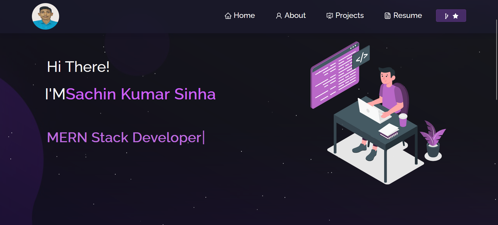

<h2 align="center">
  Portfolio Website v1.0 
  <a href="#" target="_blank">Sachin_Sinah</a>
</h2>

  

 

<h3 align="center">
    🔹
    <a href="https://github.com/Sinhasachin067/Sachinportfolio/issues">Report Bug</a> &nbsp; &nbsp;
    🔹
   
</h3>

Clone down this repository. You will need `node.js` and `git` installed globally on your machine.

## 🛠 Installation and Setup Instructions

1. Installation: `npm install`

2. In the project directory, you can run: `npm start`
